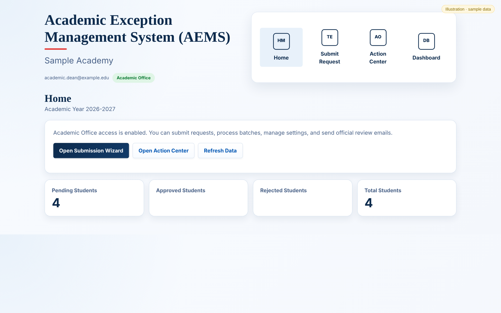
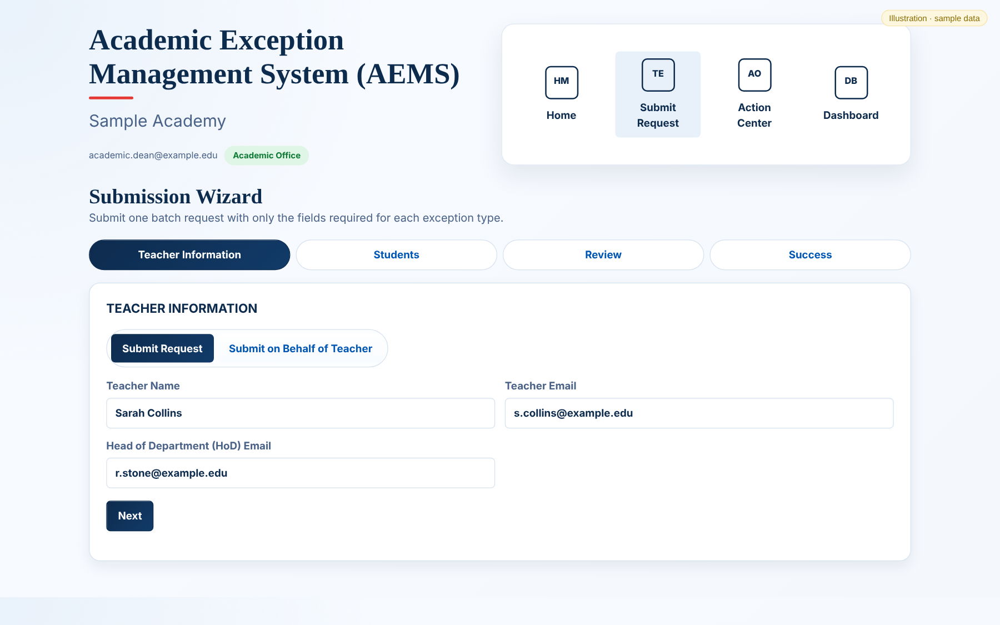
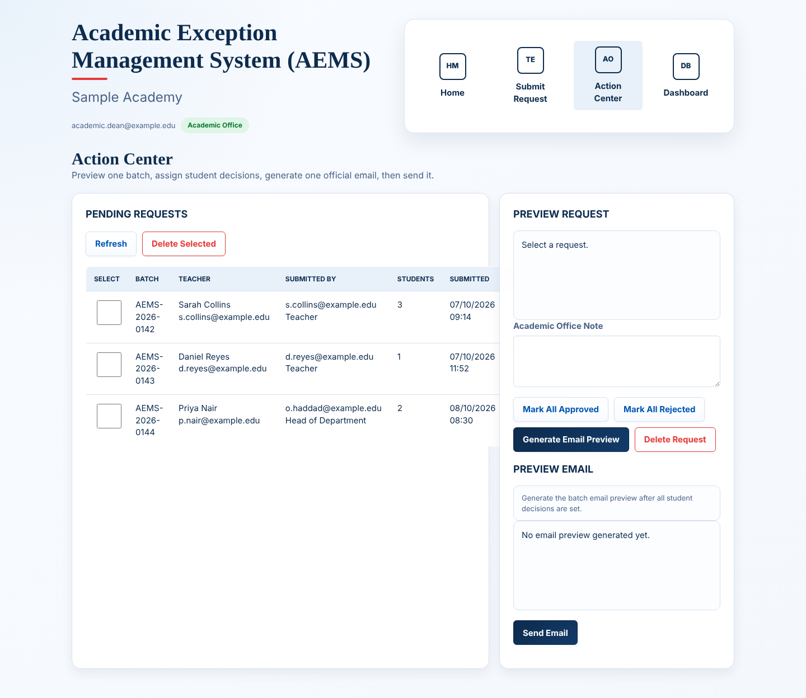
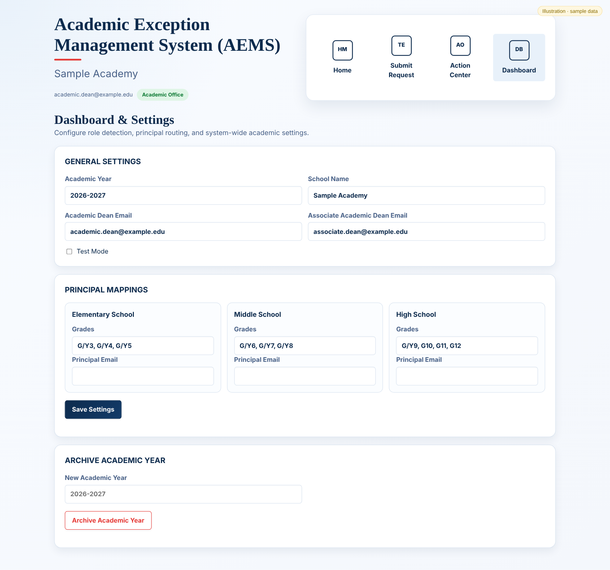
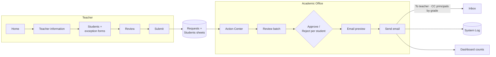

# Academic Exception Management System (AEMS)

> **Manual Grading and Academic Exception Request System**

A professional Google Apps Script web application designed to streamline the submission, review, approval, and documentation of manual grading requests and academic exceptions in K–12 American schools.

Developed by **Randa ELGawish** as the first module of the **Academic Dean Suite**.

---

## Screenshots

> Illustrations generated by running the project's real code against **fictional sample data**. No real school, staff or student data is included.

📖 **[Read the full illustrated guide](docs/GUIDE.md)**: every screen, tab, menu item, dialog and email, explained.

**Home: role-aware landing page with live counts**



**Submission Wizard: step-by-step request form for teachers**



**Action Center: pending batches, decisions and email generation**



**Dashboard & Settings: principal mapping and year archive**



## Overview

The Academic Exception Management System (AEMS) is a lightweight workflow management platform that digitizes academic exception requests while replacing manual emails, paper forms, and spreadsheets with a structured approval process.

The system enables teachers to submit exception requests for one or multiple students, allows Academic Deans to review and process those requests, automatically notifies teachers and relevant principals, and maintains a complete audit trail of all decisions.

The project was built around real-world academic leadership workflows with a strong focus on simplicity, maintainability, and operational efficiency.

---

## Key Features

### Teacher Portal

- Guided submission wizard
- Multi-student batch requests
- Dynamic exception forms
- Supporting evidence upload
- Batch review before submission

### Academic Office

- Action Center for pending requests
- Request preview
- Batch approval and rejection
- Professional email preview
- Automated email delivery
- Dashboard with live statistics

### Intelligent Email Engine

- Professional approval and rejection emails
- Exception-specific templates
- Automatic teacher notification
- Automatic principal CC based on student grade levels
- Batch email generation

### System Administration

- Academic year management
- Principal email configuration
- Academic Dean role management
- System logging
- Academic year archive and reset

---

## Supported Exception Types

### Recurring Glitched Attempt

Manual grading requests caused by technical issues affecting digital assessments.

### Suspended Account

Manual grading requests resulting from LMS account suspension.

### Academic Integrity

Cases involving plagiarism or cheating supported by evidence and administrative review.

---

## Supported Grade Levels

- G/Y3
- G/Y4
- G/Y5
- G/Y6
- G/Y7
- G/Y8
- G/Y9
- G10
- G11
- G12

---

## Supported Subjects

- English
- Mathematics
- Calculus
- Statistics
- Mechanics
- Science
- Physical Science
- Biology
- Advanced Biology
- Chemistry
- Physics
- History
- Social Studies
- Global Perspective
- Economics
- Political Science
- Business
- Psychology
- Sociology
- French
- German
- Arabic
- Arabic Social Studies

---

## Technology Stack

- Google Apps Script
- Google Sheets
- Gmail Services
- HTML5
- CSS3
- Vanilla JavaScript

No external frameworks or third-party libraries are required.

---

## System Workflow



---

## Project Structure

### Backend

```
Code.gs
Teacher.gs
ActionCenter.gs
Email.gs
Dashboard.gs
Settings.gs
```

### Frontend

```
Index.html
Styles.html
TeacherWizard.html
ActionCenter.html
Dashboard.html
```

---

## Design Principles

The project follows five core principles:

- Simplicity
- Reliability
- Maintainability
- Professional Communication
- Workflow Automation

Every feature has been designed to reduce administrative workload while maintaining institutional standards and complete traceability.

---

## Future Development

AEMS is the first module of the **Academic Dean Suite**, an integrated collection of workflow applications designed to support academic leadership.

Planned modules include:

- Lesson Plan Tracking System
- Remedial Program Management
- Teacher Observation System
- Minutes of Meeting (MoM)
- Weekly Status Reporting
- Academic Ticket Management

---

## License

[MIT](LICENSE) © Randa ELGawish

---

## Author

**Randa ELGawish**, Academic leader and EdTech developer
[LinkedIn](https://www.linkedin.com/in/randaelgawishegy) · [GitHub](https://github.com/RandaELGawish93)

---

> *Designed by an Academic Dean, for Academic Leaders.*
