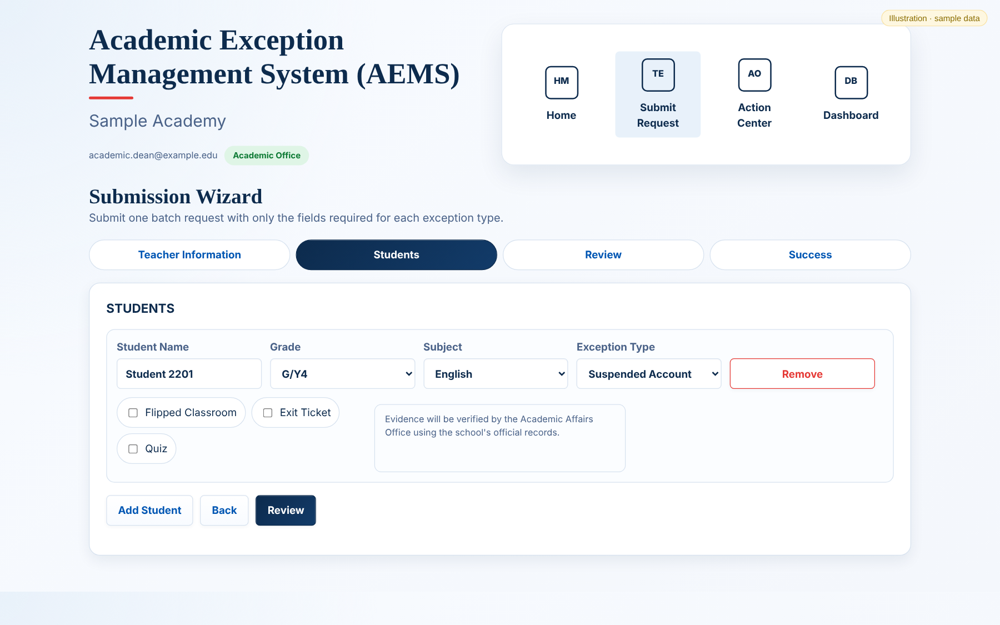
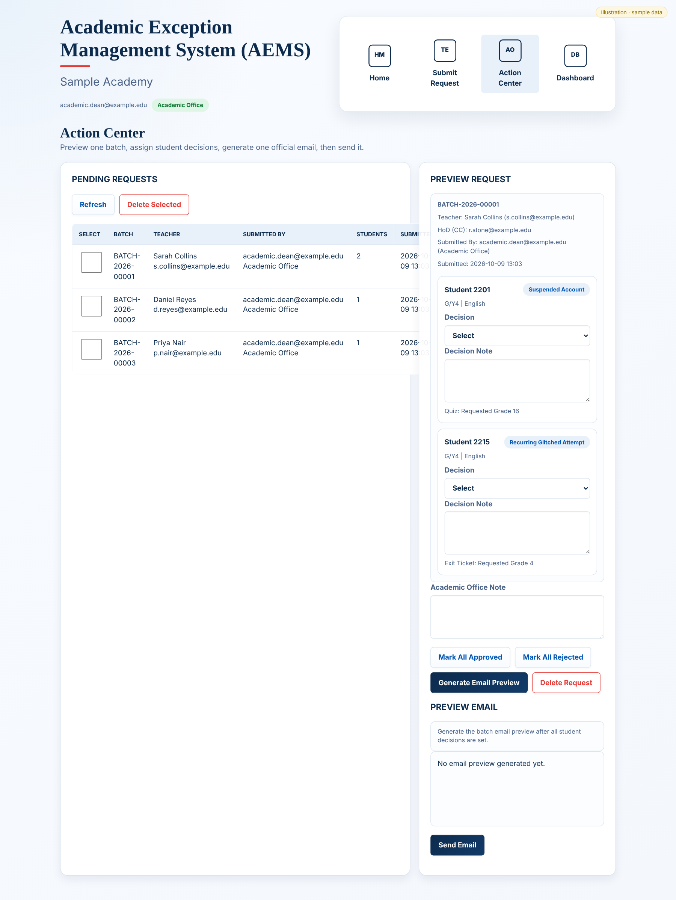
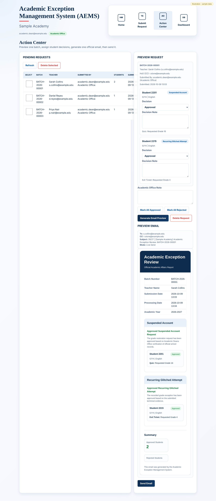
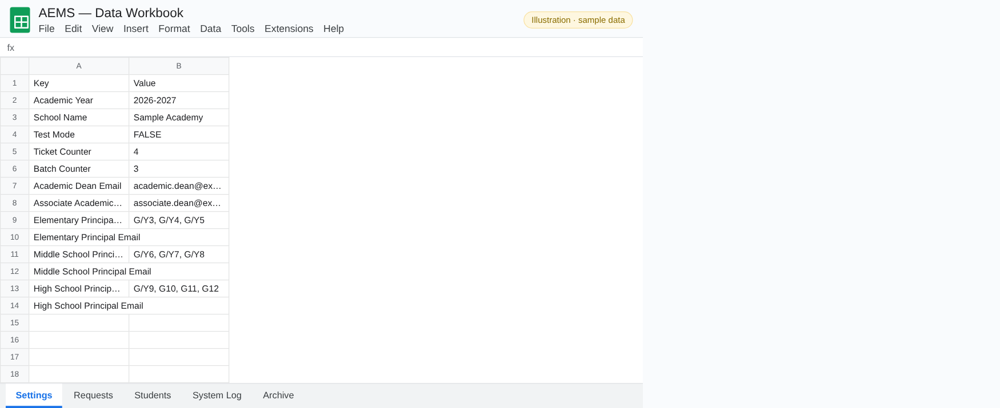
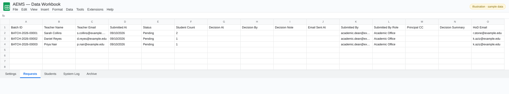
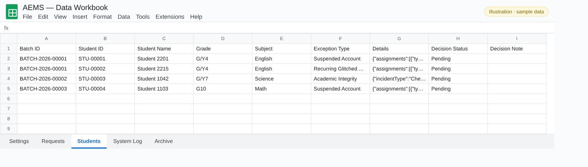
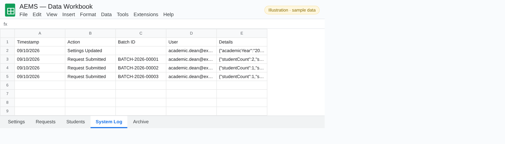
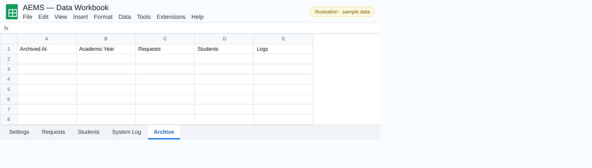

# Academic Exception Management System (AEMS): illustrated guide

How teachers submit exception requests and how the Academic Office reviews them, screen by screen.

> Every picture in this guide is an **illustration filled with fictional sample data** (names like *Sarah Collins*, emails at `example.edu`). No real school, staff or student data appears anywhere in this repository.

## Contents

- [Navigation](#navigation)
- [Submission Wizard (teachers)](#submission-wizard-teachers)
- [Action Center (Academic Office)](#action-center-academic-office)
- [Dashboard & Settings](#dashboard--settings)
- [Data workbook tabs](#data-workbook-tabs)

## Navigation

AEMS is a web app (deployed from Apps Script with `doGet`), so it has no spreadsheet menu. The four tiles at the top of every page are the navigation. Teachers only see **Home** and **Submit Request**; members of the Academic Office also see **Action Center** and **Dashboard**.

### Home

Shows the signed-in user and their role, shortcut buttons (**Open Submission Wizard**, **Open Action Center**, **Refresh Data**) and live counts of pending, approved, rejected and total students.

## Submission Wizard (teachers)

A teacher submits one batch for one or several students in four steps: Teacher Information → Students → Review → Success.

### Step 1: Teacher information

The teacher's name, email and Head of Department email. Academic Office users can also **Submit on Behalf of Teacher**.

### Step 2: Students

For each student: name, grade, subject and the exception type. The form changes with the type: assignment-based types (Suspended Account, Recurring Glitched Attempt) show the affected assignments, while Academic Integrity asks for incident details and evidence files. **Add Student** adds another student to the same batch, then **Review** checks everything before submitting.

## Action Center (Academic Office)

### Pending requests

Every batch waiting for a decision, with the teacher, who submitted it, the number of students and the date. Tick batches to delete them, or click one to open it.

### Request preview and decisions

Opens the batch: each student card shows the exception details. Choose **Approve** or **Reject** for each student (or **Mark All Approved / Rejected**) and add a decision note and an Academic Office note.

### Email preview

**Generate Email Preview** builds one official email for the whole batch, grouped by decision, with the teacher in To and the principals of the students' grade levels in CC. **Send Email** sends it, records the decisions and writes to the System Log.

## Dashboard & Settings

### Dashboard and settings

General settings (academic year, school name, Academic Dean and Associate Dean emails, Test Mode), **principal mappings** (which grades belong to each division and the principal's email, used for CC routing) and **Archive Academic Year**, which moves the year's requests to the Archive tab and starts a new year.

## Data workbook tabs

All data lives in a normal Google Sheet that the web app reads and writes.

### Settings

Key-value settings, including the ticket and batch counters and the principal mappings.

### Requests

One row per batch: teacher, dates, status, decision, who decided and when, the email sent and the CC list.

### Students

One row per student in a batch, with the exception type, the details stored as JSON and the decision.

### System Log

An audit trail of every action (settings updated, request submitted, decision sent) with the user and the details.

### Archive

Filled by **Archive Academic Year**.

---

[← Back to the README](../README.md)
